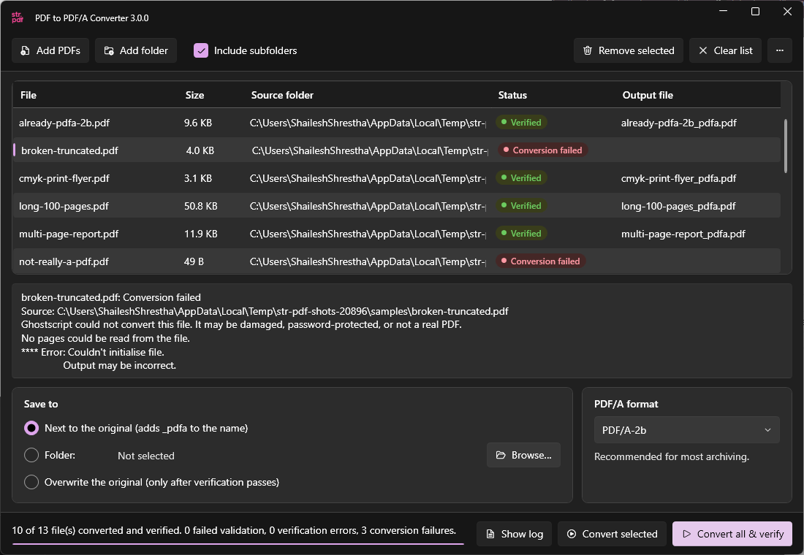

# PDF to PDF/A Converter

> **Internal tool of str.ucture GmbH.** If you are not part of str.ucture GmbH, this software was not provided to you. It comes with no warranty, support, or liability. See [NOTICE](NOTICE.md).

Turn ordinary PDFs into archive-ready **PDF/A** files, and have each one checked automatically. Everything runs on your own computer: no internet, no account, no upload.

## Get started

1. **Download** `str-pdf-windows-x64.zip` from the **Releases** page of this repository.
2. **Extract** it: right-click the ZIP › **Extract All…** › **Extract**. (It won't work if you run it from inside the ZIP.)
3. **Open** the extracted folder and double-click **`str-pdf.exe`**.

The first time you open it, Windows may show *"Windows protected your PC"*. Click **More info › Run anyway**. Nothing needs to be installed.

## Convert your files

1. **Add PDFs.** Drag files or folders onto the window, or click **Add PDFs** or **Add folder**.
2. **Choose where to save** (bottom left):
   - **Next to the original** saves `name_pdfa.pdf` beside each file *(recommended)*.
   - **Folder** saves all results in one folder you choose.
   - **Overwrite the original** replaces each file, but only after it has passed the check.
3. **Choose the format** (bottom right). Keep **PDF/A-2b** unless you've been told otherwise.
4. Click **Convert all & verify**.

Each file then shows its result:

| Result | Meaning |
|---|---|
| 🟢 **Verified** | Converted and passed the PDF/A check. Double-click it to open the result. |
| 🔴 **Validation failed** | Converted, but it didn't pass the check. Your original is untouched, and the attempt is kept as `name-validation-failed.pdf`. |
| 🔴 **Conversion failed** | The file couldn't be read. It may be damaged, password-protected, or not really a PDF. Your original is untouched. |
| ⚪ **Cancelled** | You pressed **Cancel** before this file was finished. |

Click any row to see details below the list, including why a file failed.

## Good to know

- **Your originals are safe.** A file is only replaced if you pick *Overwrite the original*, confirm it, and the result passes the check. Still, keep backups of important documents.
- **Password-protected PDFs** can't be converted. Remove the password first, for example by printing to PDF.
- **Already have files with the same name?** You'll be asked whether to replace them or save numbered copies.
- **Right-click a row** to open the result, show it in its folder, convert it again, or remove it from the list.
- **Light or dark:** click **…** (top right) › **Theme**. *Use system setting* follows Windows automatically.
- **Your choices are remembered** (save location, format, theme). Overwrite is never remembered, for safety.
- **To remove the app,** delete its folder. To also remove its settings, delete `%APPDATA%\str-pdf`.

## Which PDF/A format?

| Format | Use it when |
|---|---|
| **PDF/A-2b** | Almost always. The standard choice for long-term archiving. |
| **PDF/A-1b** | An old archive system specifically requires PDF/A-1. |
| **PDF/A-3b** | You need to keep file attachments inside the PDF (for example e-invoices). |

## Problems?

| Problem | What to do |
|---|---|
| "Engine missing" message | The folder is incomplete. Extract the whole ZIP again, and don't move `str-pdf.exe` out of its folder. |
| Nothing happens when you open it | Make sure you extracted the ZIP first (step 2). |
| A file keeps failing | Select it and read the details. Click **Show log** for the full technical output to send to the maintainer. |

Contact: info@str-ucture.com

---

[Notice and disclaimer](NOTICE.md) · [License (GNU AGPL v3)](LICENSE) · [Third-party notices](THIRD_PARTY_NOTICES.md) · [For maintainers](docs/DEVELOPMENT.md)
