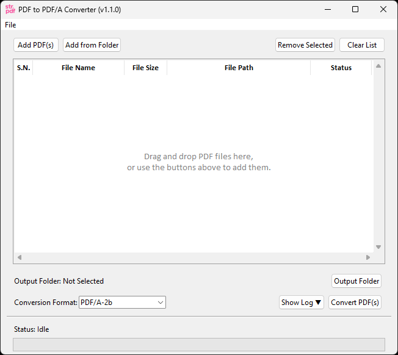

# 🗂️ str-pdf (v1.1.0)

**str-pdf** is a user-friendly desktop application for converting standard PDF files into the **PDF/A** format — a specialized version of PDF designed for the long-term archiving and preservation of electronic documents.

This app provides a simple graphical interface and batch processing capabilities, making it easy to prepare multiple documents for archival. It uses [Ghostscript](https://www.ghostscript.com/) as its conversion engine, which is distributed under the **GNU AGPLv3 license**.

-----

## ✨ Key Features

The new version focuses on a streamlined user experience and powerful features:

  - **Intuitive GUI**: A clean and simple graphical interface for managing files.
  - **Batch Conversion**: Convert multiple PDF files at once.
  - **Multiple PDF/A Formats**: Choose between `PDF/A-1b`, `PDF/A-2b` (default), and `PDF/A-3b`.
  - **Drag & Drop**: Easily add files by dragging them onto the application window.
  - **Folder Support**: Add all PDF files from a selected folder in one click.
  - **Conflict Resolution**: Choose to overwrite existing files or save them as copies if a file with the same name exists in the output folder.
  - **Safe In-Place Overwrites**: Safely overwrites source files (if the output folder is the same as the source) by using a temporary file to prevent data loss on conversion failure.
  - **Real-time Logging**: An optional log panel shows detailed Ghostscript conversion commands and progress.
  - **Progress Tracking**: A progress bar and status updates keep you informed during the conversion process.

-----

## 🖼️ Screenshot



-----

## 🚀 Getting Started

### For Users (Using the `.exe`)

1.  Download `str-pdf.exe` and the `utils` folder.

2.  Place them in the same directory. Your folder structure must look like this:

    ```
    <your-app-directory>/
    ├── str-pdf.exe
    └── utils/
        ├── auth.bin
        ├── str.ico
        └── btn_copy.ico
        # Optional, see developer notes
        └── gsdll64.dll
    ```

### How to Use the Application

1.  **Add Files**:
      - Click **"Add PDF(s)"** to select one or more files.
      - Click **"Add from Folder"** to add all PDFs from a specific folder.
      - Or, **drag and drop** your PDF files directly into the file list area.
2.  **Select Output Folder**:
      - Click the **"Output Folder"** button and choose a destination where your converted PDF/A files will be saved.
3.  **Choose Conversion Format**:
      - Select your desired PDF/A standard from the dropdown menu (e.g., `PDF/A-2b`).
4.  **Convert**:
      - Click the **"Convert PDF(s)"** button to begin the process.
      - You can monitor the progress bar and view detailed logs by clicking **"Show Log ▼"**.

-----

## 🔑 Authentication Key Requirement

To use the application, you must have a valid authentication key stored locally. This key is checked against a remote source to ensure the app is up-to-date and authorized.

**Instructions:**

1.  Navigate to the `utils` folder.
2.  Ensure a file named `auth.bin` exists.
      - **If it does not exist**, create it.
      - **Paste the authentication key** found at the following URL into the `auth.bin` file:
        ```
        https://raw.githubusercontent.com/str-ucture/str-key/refs/heads/main/key_25.txt
        ```
      - **Save** the file. The app will automatically compare your local key with the remote one upon startup.

### Note on Key Availability (Kill Switch)

The remote check acts as a "kill switch." If the key URL becomes unavailable, the application will not run. This is intentional and may occur if:

  - An update, change, or maintenance is in progress.
  - The administrator has temporarily disabled access for security or maintenance reasons.

This mechanism is fully visible and editable in the source code (`str-pdf.py`) for users who wish to build the app from source, in compliance with the AGPL license.

-----

## 🖥️ Dependencies & Developer Notes

The application relies on Ghostscript for PDF conversion.

1.  **Ghostscript Binary (`gsdll64.dll`)**
    The `ghostscript` Python library requires the Ghostscript binary to be available.

      - **Packaged Version**: The `utils` folder can contain `gsdll64.dll`. This allows the application to run portably without a system-wide Ghostscript installation.
      - **System-wide Install**: If you have Ghostscript installed on your system and its `bin` directory is in your system's PATH, the `gsdll64.dll` in the `utils` folder is not required.

2.  **Modified Python Library (`_gsprint.py`) - For Developers**
    *(This information is primarily for those building from source).*
    The original `README` mentioned a modified `ghostscript/_gsprint.py` file. If you encounter issues while building from source, ensure you are using the correct library versions or apply any necessary patches as described in the original documentation. For most users of the `.exe`, this is not a concern.

-----

## 📄 License

This project is licensed under the **GNU Affero General Public License v3.0 (AGPL-3.0)**. You are free to use, modify, and distribute it under the same license terms.